# [fit] Serverless Architecture
# [fit] for
# [fit] Powerful Data Pipelines
<br>

## Jason A Myers


^ Welcome to Leveraging Serverless Architecture for Powerful Data Pipelines. My start with data pipelines was as an aspiring analytical chemist intern while in high school.

---


Credit: Horst Felske and Fritz Schiemann
[ex-convex.org](http://www.ex-convex.org/fritz/exConvex/sican/index.html)

^ I was working at an air force base using a convex mainframe like you see here to enter and calculate numbers from a real analytical chemist's experiments. That started this strange fascination with data or ETL pipelines

---

# Issues

- Scheduled
- Complex
- Scaling
- Recovery

^ Traditional pipelines are often kicked off at a scheduled time and depending on resources we may need to be careful about overlap. Pipelines with multiple phases and interdependencies quickly become too complex to reason about sanely. I know I've certainly loaded absolute trash data via ETL all because of not understanding some part of a pipeline. This complexity makes it difficult to scale pipelines as our data sets rapidly expand or evolve. And what happens when stuff goes south: retry, replay or Knuth forbid syncing ever need to be done.

---


Credit: Anonymous

---

# Python Toolkits and Services

- [Luigi](http://luigi.readthedocs.io/en/stable/index.html)
- [Airflow](https://airflow.incubator.apache.org/)
- [AWS Data Pipeline](https://aws.amazon.com/datapipeline/)

^ Thankfully now, we have wonderful toolkits and services like Luigi, Airflow, and Data Pipeline to let help us focus on the sources, transformations, outputs, and notifications in a sane manner, as well as, handling a bit of what happens when we don't execute properly with things like back fill, task retry etc. However, I'm often still needing some other component to help react to events (triggering), scale out (parallelization), or mix in streaming sources. I don't say these things to pick on these tools, as I don't think all of this is their responsibility and they've all made wise choices about what the tools are good at and what is left to the implementor. For me, I like to fill in some of these gaps with...

---

# [fit] SERVERLESS

^ SERVERLESS!

---


---

# Cloud Functions

^ Event Driven, Automatic STDOUT logging, Permission Based Execution

---


^ Many cloud providers offer them... We're going to focus on AWS Lambda since it's been around the longest; however, all three of them work quite well and have a slightly varying feature set but the overall concepts apply.

---


---

# Simple Pipeline overview

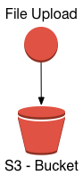


---

# Simple Pipeline overview

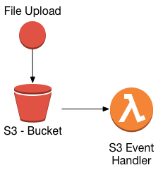


---
# Simple Pipeline overview

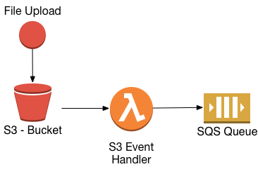


---
# Simple Pipeline overview

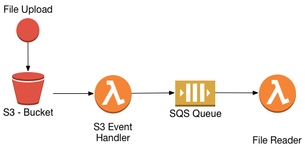


---
# Simple Pipeline overview

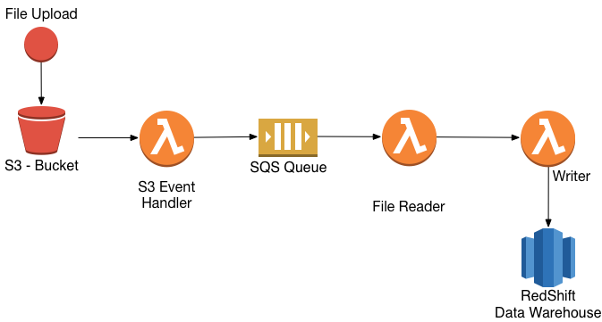


---
# Simple Pipeline overview

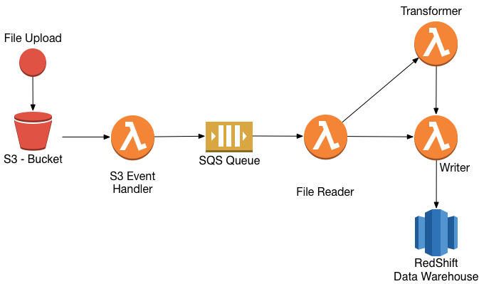


---
# Simple Pipeline overview

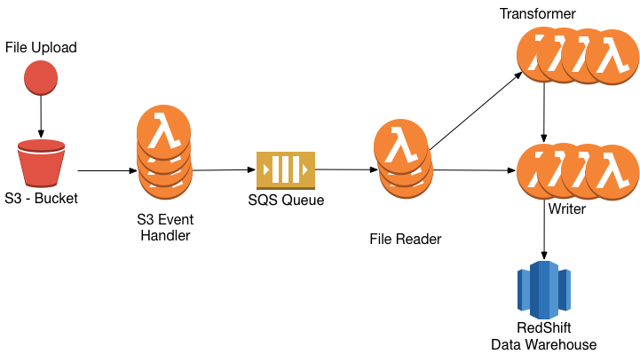


---

# Serverless Python Tools

- Zappa
- Apex
- Chalice
- Serverless

^ What are these good for...

---

# Apex

- Multiple Environment Support
- Function Deployment
- Infrastructure as code via Terraform

---
# Project Structure

```
├── functions
│   └── listener
│       └── main.py
├── infrastructure
│   ├── dev
│   │   ├── main.tf
│   │   ├── outputs.tf
│   │   └── variables.tf
│   ├── prod
│   │   ├── main.tf
│   │   ├── outputs.tf
│   │   └── variables.tf
├── project.json
└── project.prod.json
```

---
# Apex package.json

```
{
  "name": "listener",
  "description": "S3 File Listener",
  "runtime": "python",
  "memory": 128,
  "timeout": 5,
  "role": "arn:aws:iam::ACOUNTNUM:role/listen_lambda_function",
  "environment": {},
  "defaultEnvironment": "dev"
}
```

---

# S3 Event Handler

```
import logging

import boto3

log = logging.getLogger()
log.setLevel(logging.DEBUG)

def get_bucket_key(event);
    bucket = event['Records'][0]['s3']['bucket']['name']
    key = event['Records'][0]['s3']['object']['key']
    return bucket, key

def handle(event, context):
    log.info('{}-{}'.format(event, context))
    bucket_name, key_name = get_bucket(event)
```
---

# S3 Event Handler (cont.)
```
values = {
    'bucket_name': bucket_name,
    'key_name': key_name,
    'timestamp': datetime.utcnow().isoformat()
}

client = boto3.client('sns')
client.publish(
    TopicArn=topic_arn,
    Message=json.dumps(values)
)
```

---

# AWS Logging Permissions

```
data "aws_iam_policy_document" "listener_logging" {
  statement {
    sid       = "AllowRoleToOutputCloudWatchLogs"
    effect    = "Allow"
    actions   = ["logs:*"]
    resources = ["*"]
  }
}

resource "aws_iam_policy" "listen_logs" {
  name        = "listener_logs"
  description = "Allow listener to log operations"
  policy      = "${data.aws_iam_policy_document.listener_logging.json}"
}
```
---

# AWS IAM Role Assumption

```
data "aws_iam_policy_document" "listener_lambda_assume_role" {
  statement {
    sid     = "AllowRoleToBeUsedbyLambda"
    effect  = "Allow"
    actions = ["sts:AssumeRole"]

    principals {
      type        = "Service"
      identifiers = ["lambda.amazonaws.com"]
    }
  }
}

resource "aws_iam_role" "listener_lambda_function" {
  name               = "listener_lambda_function"
  assume_role_policy = "${data.aws_iam_policy_document.listener_lambda_assume_role.json}"
}
```

---

# AWS Policy Attachment

```
resource "aws_iam_policy_attachment" "listener_attach" {
  name       = "listener_attach"
  roles      = ["${aws_iam_role.listener_lambda_function.name}"]
  policy_arn = "${aws_iam_policy.listener.arn}"
}

resource "aws_iam_policy_attachment" "prod_s3_copy_logs_attach" {
  name       = "listener_logs_attach"
  roles      = ["${aws_iam_role.listener_lambda_function.name}"]
  policy_arn = "${aws_iam_policy.listener_logs.arn}"
}
```

---

# Deploy Function and Infrastructure

```
# apex deploy
# apex infra plan
# apex infra apply
```

---

# [fit] What about those
# [fit]  other *functions*...

---


# Lambda Packages

## Zappa Project/Gun.io


---

Lambda | Packages | List
--- | --- | ---
bcrypt | cffi | PyNaCl
datrie | LXML | misaka
MySQL-Python | numpy | OpenCV
Pillow (PIL) | psycopg2 | PyCrypto
cryptography   | pyproj | python-ldap
python-Levenshtein | regex |

---

# Dependency Handling in Apex

```
"hooks":{
    "build": "pip install -r requirements.txt -t ."
}
```
---

# Function Considerations

- atomic
- idempotent

---

# Dis is the Remix

- Longer Jobs
- Legacy Pipelines

---

# Hybrid Pipeline overview

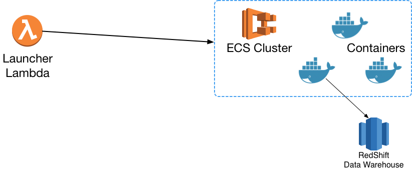


---
# Hybrid Pipeline overview

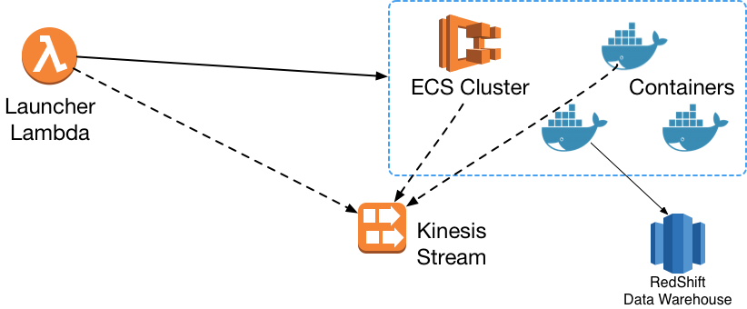


---
# Hybrid Pipeline overview

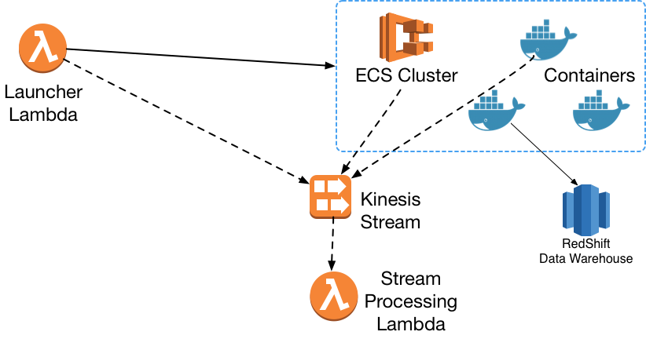


---
# Hybrid Pipeline overview

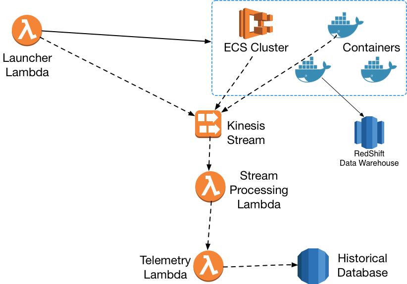


---
# Hybrid Pipeline overview

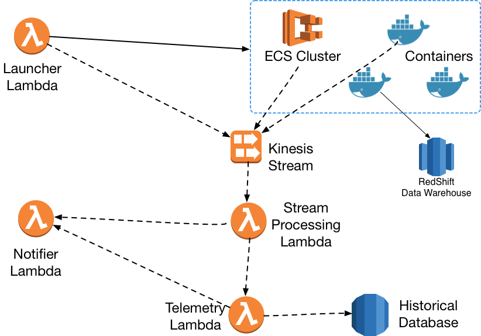


---

# Speeds and Feeds

- Workload and Phases are important

- 4x improvement
- 0.73x improvement

---

# [fit] Questions?
